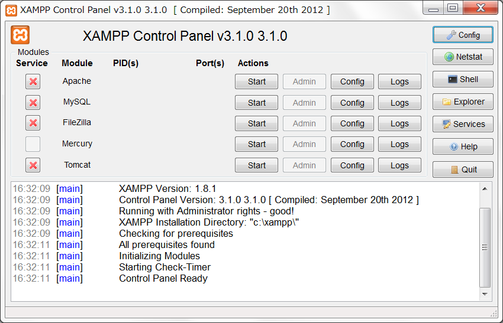

# STEP1-3.WEBサーバを立ててみる

それではWEBサーバを実際に立ててみましょう。

WEBサーバには無料で利用できるApache HTTP ServerやMicrosoft製のIISをはじめとして様々な種類のものがあり、当然自作することもできます。今回は最も利用者数が多いApacheを使用します。XAMPPというApacheの他にも様々なものを含んだパッケージをインストールしましょう。

### Windowsの場合

[XAMPP for Windows](http://www.apachefriends.org/jp/xampp-windows.html#2671)からインストーラ版をダウンロード、実行します。途中で以下の画面になると思います。

ここでインストールするソフトウェアを選択できます。ApacheがWebサーバ、MySQLがデータベースシステム、PHPがサーバで使用するプログラミング言語、phpMyAdminがデータベースをブラウザから操作するためのツールですのでこれらは必ずインストールしてください。インストールが完了したらコントロールパネルを起動してみましょう。

Apacheの横にあるStartボタンを押すとWebサーバが起動します。ブラウザで[http://localhost/](http://localhost/)を表示してみましょう。正しく起動できていたらXAMPPのページが表示されるはずです。